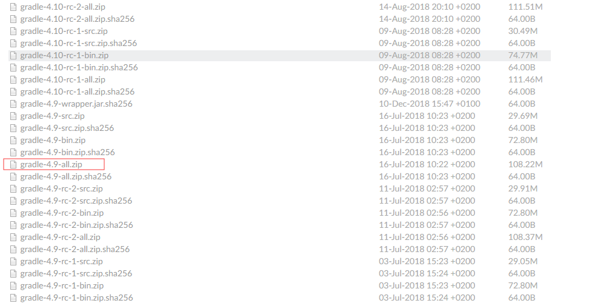
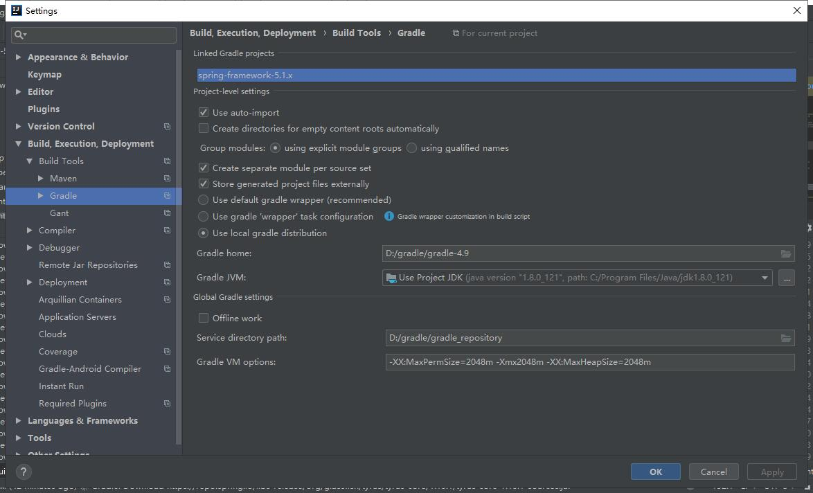

# spring源码构建(IDEA)

## 1.配置gradle

- 下载, [https://services.gradle.org/distributions/](https://services.gradle.org/distributions/)

 

- 配置环境变量

  D:\gradle\gradle-4.9

## 2.下载源码

- 链接:[https://github.com/spring-projects/spring-framework.git]()

- 编译文件,获取相关依赖:gradlew :spring-oxm:compileTestJava    

- IDEA导入源码

- 相关设置

  

  缺失DefaultNamingPolicy解决方案

  进入源码的目录，执行：gradle objenesisRepackJar 、    gradle cglibRepackJar